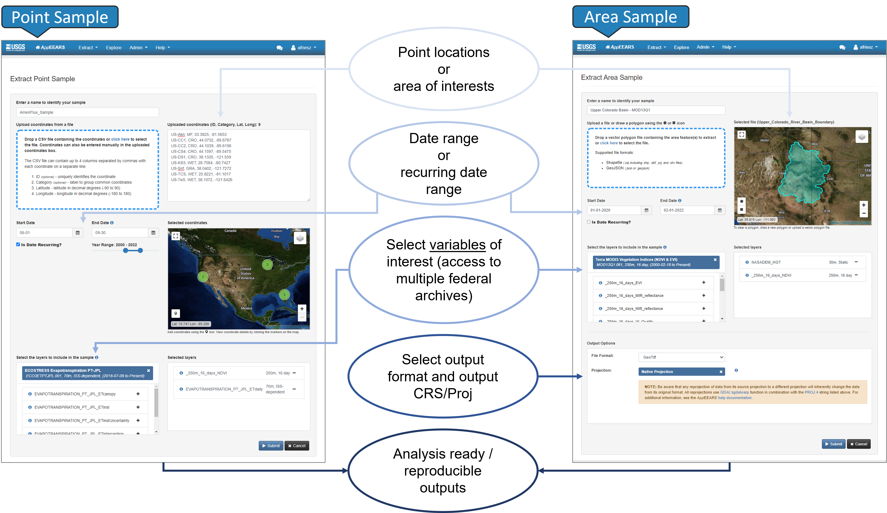

# Application for Extracting and Exploring Analysis Ready Samples (AρρEEARS)

The Application for Extracting and Exploring Analysis Ready Samples ([AppEEARS](https://appeears.earthdatacloud.nasa.gov/)) offers a simple and efficient way to access and transform geospatial data from a variety of federal data archives in an easy-to-use web application interface. AppEEARS enables users to subset geospatial data spatially, temporally, and by band/layer for point and area samples. AppEEARS returns not only the requested data, but also the associated quality values, and offers interactive visualizations with summary statistics in the web interface. This tutorial shows how to use AppEEARS to access ECOSTRESS version 2 data hosted in the cloud.

### Step 1. Sign in 

Sign in using your Earthdata login credentials. If you do not have an Earthdata account, Create an Earthdata Login account at https://urs.earthdata.nasa.gov.  

### Step 2. Extract the Sample 

Select the Point or Area sample using Extract dropdown. You will be directed to Extract Area or Point Sample page.  
1. Enter your sample name.   
2. Upload your **area of interest** or draw a polygon on the leaflet map for area sample. For point sample, provide the CSV file including the latitude  and longitude coordinates. You can also use the map to manually select your locations or type them directly.   
3. Select your **time period of interest**.  
4. Add **datasets** you are interested in to your Selected Layers. You can choose from various [data collections available in AppEEARS](https://appeears.earthdatacloud.nasa.gov/products). You can click on the (i) icon for the dataset to see more details.
In this example we are interested in the [ECOSTRESS LSTE](https://doi.org/10.5067/ECOSTRESS/ECO_L2_LSTE.002) which is managed by the LP DAAC and made available from the NASA Earthdata Cloud archive hosted in the AWS cloud.
   
5. For area sample, you can select your **output file format**. You also have an option to **reproject** all your layers to another coordinate reference system.   
6. Now you can **submit**.   

 

Once your request is complete, you can **View** and **Download** your results from the Explore Requets page. 

### Step 3. Explore the outputs
From the Explore Requests page, click the View icon in order to view and interact with your results. This will take you to the View Area Sample page.

### Step 4. Download the outputs  

Finally navigate to Download Sample page by clicking the Download icon on the Explore Requests page or from View Sample page to download your results. Besides your actual outputs, you will have access to supporting files including a text file with URLs to source data, a JSON file you can use to recreate the same sample, decoded quality information, and CSV file with the layer statistics.

Check out AppEEARS [help documentation](https://appeears.earthdatacloud.nasa.gov/help) for more details. If you wish to access AppEEARS programatically check out [AppEEARS API documenation](https://appeears.earthdatacloud.nasa.gov/api/). 
